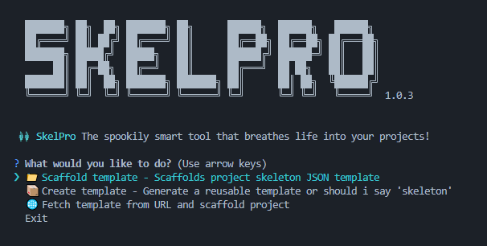

# **Skeleton Project (SkelPro)**

SkelPro is a fast and simple CLI tool for creating and setting up a project structure. It uses pre-defined templates stored in a JSON file to create and organize project structure.

Whether you're starting something new or working on similar projects regularly, SkelPro saves you time and keeps your setup consistent.


<!-- ## Introduction 📚   -->


## Features ✨  
- **JSON Templates:** Easily manage your project templates with a simple JSON file.  
- **Quick Setup:** Instantly scaffold a project with a predefined structure.  
- **Simple CLI:** Clean interface and simple CLI commands to get started fast.
- **Transparency:** Clearly see what's in the template.

## Installation 💻  
Install **SkelPro** globally via npm:

```bash
npm install -g @skelpro/skelpro
```

## Usage 🛠️  
To launch SkelPro's interface - run:

```bash
skelpro launch
```

You’ll see a set of options in the command line. Choose what you need and follow the prompts as shown below:



<br/>

> **Note:** If you want to fetch a remote template, use a URL that returns raw JSON data. Avoid links that return HTML or other formats; SkelPro expects proper JSON..

A good example is **Github raw user content**:
```
https://raw.githubusercontent.com/<user>/<repo>/<branch>/file.json
```

---

### CLI Command Overview  
```bash
skelpro [options] [command]
```

#### Options  
| Option         | Description               |
| -------------- | ------------------------- |
| -i, --install  | Install dependencies      |
| -v, --version  | Show version              |
| -h, --help     | Show help                 |

#### Commands:
The below are the CLI commands SkelPro supports and their usage.
| Command                                         | Usage                                                            |
| ---------------------------------------------- | ---------------------------------------------------------------------- |
| `launch`                                        | Launches the main CLI interface                                        |
| `save <templateName> <projectPath>`        | Saves a new reusable project template in a JSON file                                  |
| `create <projectName> <templatePath (or) URL>`   | Creates a project using a local or remote JSON template                |
| `help [command]`                                | Show help for a specific command                                       |


## Publishing Under the Organization ✅
If you are publishing from this repository and want the package to be owned by the **SkelPro** organization, use this checklist:

1. Use an org-scoped package name in `package.json`:
   - `@skelpro/skelpro`
2. Ensure the `repository.url` points to this repository:
   - `https://github.com/SkelPro/skelpro.git`
3. Verify package visibility from the organization profile:
   - GitHub → **SkelPro** → **Packages**
4. Confirm organization package permissions:
   - Organization Settings → **Packages** → **Permissions**

> Most package-linking issues come from publishing with the wrong scope (for example, personal scope instead of org scope).

## AI Era Roadmap for SkelPro 🤖
SkelPro is already useful as a scaffolding CLI. To make it highly relevant in an AI-first workflow, focus on these upgrades:

- **Prompt-to-template generation**
  - Example: “Create a Node.js + TypeScript + Docker API starter” and generate a valid SkelPro JSON template automatically.
- **Best-practice template suggestions**
  - Recommend CI/CD, linting, tests, and folder conventions based on project type.
- **Auto-generated docs**
  - Create README files, setup instructions, and usage guides directly from template metadata.
- **Assistant actions on existing projects**
  - Add features like “insert auth boilerplate” or “add GitHub Actions workflow” through guided commands.

These changes evolve SkelPro from a template runner into an AI-assisted project architect.

## Contributing 🤝  
We’d love your help! To contribute, check out the [CONTRIBUTING](CONTRIBUTING.md) file for guidelines.

## License 📜  
Licensed under the Apache License 2.0. See the [LICENSE](LICENSE) file for details.

