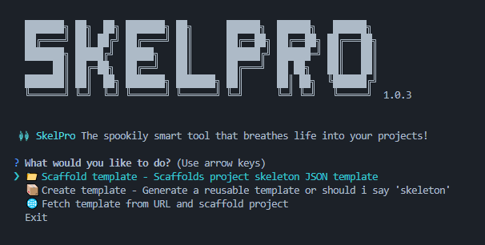

# 💀 SkelPro (Skeleton Project)
The spookily smart tool that breathes life into your projects!

## Introduction 📚
Why waste time on bare-bones setups when you can let SkelPro assemble your project’s skeleton in seconds? This bony buddy stores your project templates in a JSON file and raises them from the dead whenever you need a new project scaffold.

No more rattling around with tedious boilerplate, just flesh out your ideas while SkelPro handles the structure. It’s scary how much time you’ll save! 👻"

## Features ✨
- **JSON Storage**: Stores project configurations and templates in a JSON file for easy management and retrieval.
- **Project Scaffolding**: Quickly create a new project with a predefined structure.
- **Command Line Interface**: Easy-to-use CLI for project initialization.

## Installation 💻
You can install SkelPro via npm:

```bash
npm install -g skelpro
```
## Usage 🛠️
Don't know where to start from?, just run:

```bash
skelpro start
```
You will be presented with the following options:



Depending on your choice, provide the required inputs when prompted.

**Note:** When fetching templates from URL, fetch from URLs that returns JSON data.

## CLI command usage: 
```sh
skelpro [options] [command]
```

### Options:

| Options         | Description               |
| --------------- | ------------------------- |
| -v, --version   | Output the version number |
| -h, --help      | Display help for command  |

### Commands:
| Command                                        | Description                                                             |
| ---------------------------------------------- | ----------------------------------------------------------------------- | 
| start                                          | Start the command line interface 'Home'                                 | 
| generate \<templateName> \<projectPath>     | Generate a reusable template or should i say 'skeleton'                 | 
| scaffold \<projectName> \<templatePath>                | Scaffolds project skeleton from the specified JSON template path or URL | 
| help [command]                                 | Display help for command                                                |  

<br />
Why are skeletons so bad at lying?<br />
You can see right through them! 🤷

## Contributing 🤝
We welcome contributions! If you would like to contribute to SkelPro, please follow these steps:

- Fork the repository [SkelPro](https://www.github.com/SkelPro/skelpro).
- Create a new branch for your feature or bugfix.
- Commit your changes.
- Push the branch to your fork.
- Open a pull request.
  
## License 📜
This project is licensed under the Apache License 2.0. See the [LICENSE](LICENSE) file for more details.

Feel free to adjust the content as needed.
